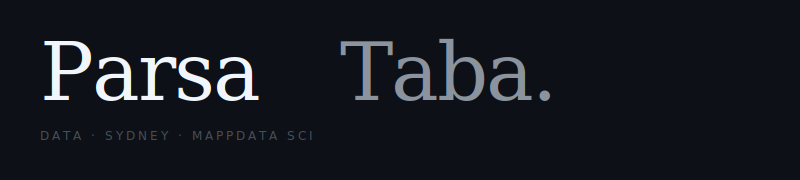

<picture>
  <source media="(prefers-color-scheme: dark)" srcset="header.svg">
  
</picture>
<svg width="800" height="180" viewBox="0 0 800 180" xmlns="http://www.w3.org/2000/svg">
  <rect width="800" height="180" fill="#0d1117"/>
  <text x="40" y="100" font-family="Georgia, serif" font-size="80" font-weight="400" fill="#f0f6fc" letter-spacing="-2">Parsa</text>
  <text x="340" y="100" font-family="Georgia, serif" font-size="80" font-style="italic" font-weight="400" fill="#8b949e" letter-spacing="-2">Taba.</text>
  <text x="40" y="140" font-family="-apple-system, BlinkMacSystemFont, sans-serif" font-size="12" font-weight="400" fill="#484f58" letter-spacing="3">DATA  ·  SYDNEY  ·  MAPPDATA SCI</text>
</svg>

 

<table width="100%" border="0" cellspacing="0" cellpadding="0">
<tr>
<td width="42%" valign="top">

**Stack**

| | |
|:--|:--|
| Languages | Python · SQL · TypeScript · R |
| Data | ETL · warehousing · Power Query |
| Analytics | Modelling · stats · predictive |
| BI | Power BI · Excel · dashboards |
| Web | Next.js · React · Tailwind · Prisma |

</td>
<td width="6%"></td>
<td width="52%" valign="top">

**About**

Data end-to-end — pipelines, warehousing, analytics.
Product data by day. Full-stack side projects nights and weekends.
Building in nightlife discovery, small business tooling, and personal health.
Most repos are private.

`Python` `SQL` `Power BI` `SAP` `Next.js` `React` `Tailwind` `Prisma` `TypeScript`

</td>
</tr>
</table>

 

---

  <a href="https://www.linkedin.com/in/parsa-taba-b60890193/">LinkedIn</a>
  &nbsp;·&nbsp;
  <a href="https://parsataba.xyz">parsataba.xyz</a>
  &nbsp;&nbsp;
  · open to connect

